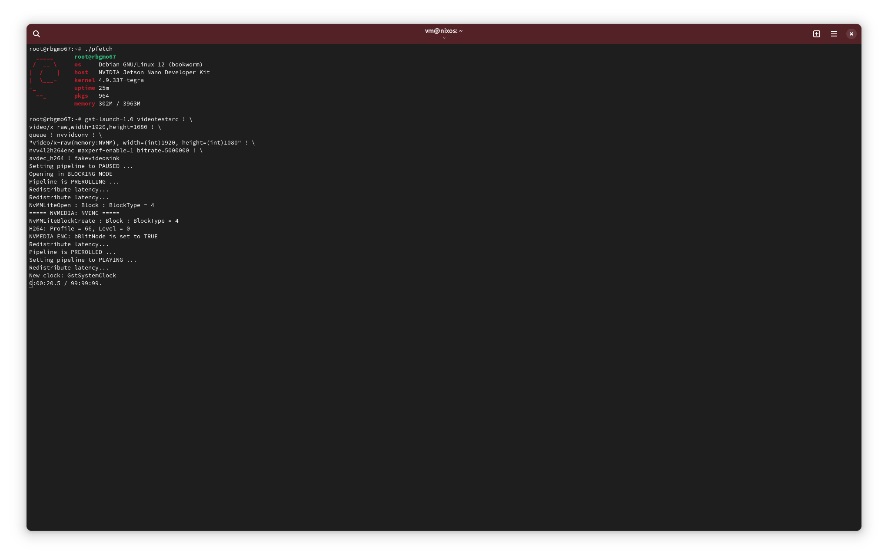

# jetson-gstreamer
This repository contains updated Nvidia Jetson GStreamer sources from v32.x.x Jetson Linux.
The goal is to patch and verify that the sources work for Debian/Ubuntu versions newer than
16.04 and newer GStreamer versions.

## Working (Confirmed):
- gst-v4l2: A collection of hardware video encoders and decoders using NVENC and NVDEC.
- gst-nvvidconv: Conversion (Memory Mapping) of video/x-raw buffers

### Headless Test Pipeline
The following pipeline was used for headless testing on an experimental Debian 12 Build 
(Created using [rootfsbuilder](https://github.com/hmelder/rootfsbuilder) which has patches
for creating Nvidia Jetson Nano root filesystems from vanilla Debian/Ubuntu bootstrapped
root filesystems.

```sh
gst-launch-1.0 videotestsrc ! video/x-raw,width=1920,height=1080 ! \
queue ! nvvidconv ! \
"video/x-raw(memory:NVMM), width=(int)1920, height=(int)1080" ! \
nvv4l2h264enc maxperf-enable=1 bitrate=5000000 ! \
avdec_h264 ! fakevideosink
```



## Untested:
This is a list of untested (even for compilation) plugins:
- gst-nvdrmvideosink
- gst-nvtee
- gst-plugins-nv-video-sinks
- libv4lconvert
- gst-jpeg
- gst-egl

## Broken:
- gst-nvcompositor: The GstVideoAggregator interface was unstable at the time this plugin was developed,
    and has since been changed. Additionally, Nvidia used private interfaces which disappeared completely.
    This plugin will need to be updated to work with the new interface.
    Note: The plugin was adapted by nvidia in the L4T 35.x.x releases, but uses a different set of
    private Nvidia APIs that are not available in the 32.x.x releases.
    Cherry-picking the changes might work.
